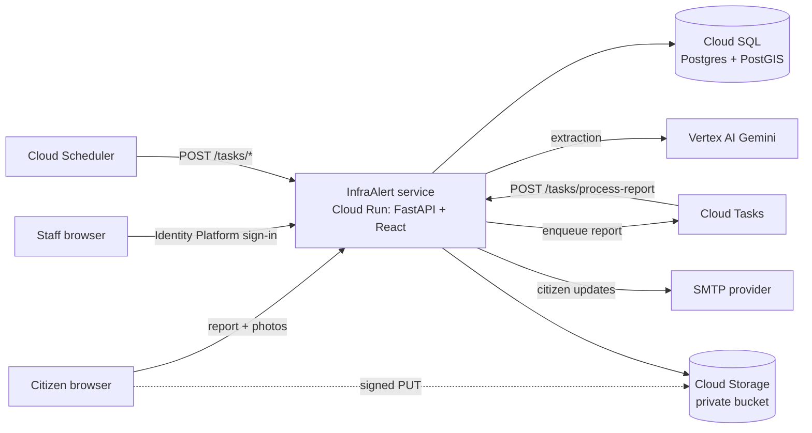

# InfraAlert

InfraAlert is a city service where citizens report infrastructure problems (potholes, water
leaks, broken streetlights, …) on a map, and city staff triage, prioritize and dispatch field
teams to fix them. A language model reads each report into structured facts; code, not the
model, computes priority, and a human dispatcher decides who is sent.

- Domain language: [CONTEXT.md](CONTEXT.md)
- Architecture decisions: [docs/adr/](docs/adr/) (start with [0001](docs/adr/0001-modular-monolith.md))
- Production deployment: [docs/deploy.md](docs/deploy.md)

## Architecture

One FastAPI service (a modular monolith, [ADR 0001](docs/adr/0001-modular-monolith.md)) serves
the API and the built React frontend. Everything that is slow or scheduled runs as an HTTP
request back into the same service, sent by Cloud Tasks or Cloud Scheduler.



| Concern | Production | Local development |
| --- | --- | --- |
| System of record ([0003](docs/adr/0003-postgres-postgis-system-of-record.md)) | Cloud SQL Postgres + PostGIS | PostGIS in Docker (`localhost:5433`) |
| Report processing ([0002](docs/adr/0002-async-processing-cloud-tasks.md)) | Cloud Tasks (`TASKS_BACKEND=cloud_tasks`) | background thread (`inline`) |
| Photos ([0008](docs/adr/0008-private-media-and-vertex-ai.md)) | private GCS bucket, signed URLs (`gcs`) | files in `var/uploads` (`local`) |
| Extraction ([0004](docs/adr/0004-llm-extracts-code-decides.md)) | Gemini on Vertex AI (`vertex`) | off: every report goes to triage (`disabled`) |
| Staff sign-in ([0007](docs/adr/0007-identity-citizens-and-staff.md)) | Identity Platform + city OIDC (`identity_platform`) | type a seeded email (`dev`) |
| Citizen emails | SMTP (`smtp`) | `.eml` files in `var/outbox` (`console`) |

All backend settings are environment variables, documented in [.env.example](.env.example);
the frontend's build-time `VITE_*` settings are in
[webapp/frontend/.env.example](webapp/frontend/.env.example).

## Local development

Requirements: [uv](https://docs.astral.sh/uv/) (`make setup-tools` installs it), Node 20+
and Docker.

```bash
make env          # create .env from .env.example (local defaults, no cloud account needed)
make install-dev  # Python deps (uv workspace) + frontend deps (npm)
make db-up        # PostGIS on localhost:5433
make db-migrate   # apply the Alembic migrations
make seed-dev     # development staff, teams and sensitive places
make dev          # backend on :8000 (auto-reload) + Vite on :5173; Ctrl-C stops both
```

Open <http://localhost:5173> to file a report and <http://localhost:5173/staff> for the staff
dashboard. With `STAFF_AUTH_BACKEND=dev`, sign in by typing one of the seeded accounts:

| Email | Role |
| --- | --- |
| `dispatcher@dev.local` | Dispatcher |
| `supervisor@dev.local` | Supervisor |
| `admin@dev.local` | Admin |

`make dev` runs the backend from the repo root, so uploaded photos land in `var/uploads/` and
citizen emails are written as `.eml` files to `var/outbox/` (both git-ignored).

To run the production image locally instead (PostGIS + the one `app` container, development
backends, migrations applied on start): `make docker-up`, then
`docker compose exec app python -m infraalert.cli seed-dev` and open <http://localhost:8000>.
Its uploads and emails live in the `app-var` volume. `make docker-down` stops it.

Other useful targets (`make help` lists them all):

```bash
make db-revision MSG="add x"   # autogenerate a migration after changing the models
make format                    # ruff format + import sorting
```

## Tests

```bash
make db-up   # the database tests need PostGIS
make test    # backend pytest + frontend vitest
make lint    # ruff
make check   # lint + mypy + tests
```

Backend database tests run against a real PostGIS: each run creates and drops its own
throwaway database on `TEST_DATABASE_URL` (the Makefile defaults it to the `db-up` database).
Without it those tests are skipped. `make test-backend` and `make test-frontend` run one side.

## Project layout

```
webapp/
  Dockerfile              the single service image (frontend build + backend)
  backend/                Python package `infraalert` (uv workspace member)
    main.py               `uvicorn main:app` entrypoint
    alembic.ini, migrations/
    infraalert/
      app.py, config.py, deps.py   app factory, settings, wiring of the backends
      citizen/            report submission and public report status
      processing/         Cloud Tasks worker: extraction, priority, grouping into incidents
      staff/              staff auth, dispatch queue, assignments, admin
      notify/             citizen email updates (verification, outbox, retention)
      places/             sensitive places and the OpenStreetMap import
      db/                 SQLAlchemy models and sessions
      cli.py              `python -m infraalert.cli create-admin | seed-dev`
    tests/
  frontend/               Vite + React (citizen site and /staff dashboard)
docs/
  adr/                    architecture decision records
  deploy.md               Google Cloud deployment guide
scripts/                  toolchain setup (uv, gcloud, .env)
docker-compose.yml        PostGIS + the app for local use
```

## Deployment

InfraAlert deploys as one Cloud Run service plus a Cloud Run job for migrations. The one-time
setup (Cloud SQL, bucket, service account, queue, scheduler jobs, secrets, Identity Platform)
is in [docs/deploy.md](docs/deploy.md); after that, `make deploy` builds, migrates and rolls
out a new version.
